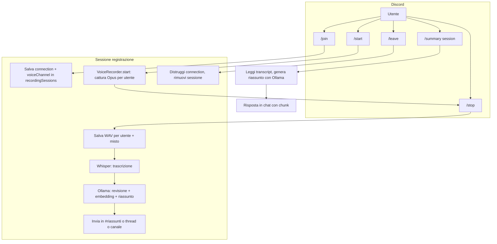
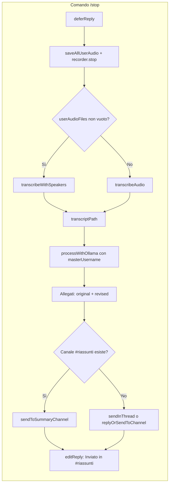

# Diagramma del flusso del bot

Flusso end-to-end del bot di trascrizione D&D: comandi Discord, registrazione voce, trascrizione Whisper, elaborazione Ollama e invio risultati.

---

## Flusso generale (high-level)

---

## Dettaglio: /join e /start

- **/join** ([src/commands/join.js](../src/commands/join.js)): utente in voice channel → `joinVoiceChannel` → `client.recordingSessions.set(guildId, { connection, voiceChannel, recording: false, ... })` → risposta "Joined! Use /start".
- **/start** ([src/commands/start.js](../src/commands/start.js)): verifica connection e sessione → crea `VoiceRecorder(connection, guildId, sessionName, client)` → `recorder.start()` → sessione aggiornata con `recorder`, `sessionName`, `recording: true`, **`masterUserId: interaction.user.id`** → risposta "Recording started".

---

## Dettaglio: registrazione voce (VoiceRecorder)

- **VoiceRecorder** ([src/voice/recorder.js](../src/voice/recorder.js), [src/voice/audioStream.js](../src/voice/audioStream.js)): su `receiver.speaking.on('start', userId)` → sottoscrive lo stream Opus per utente, aggiunge a **AudioMixer** (per-user packets + speaking segments). Su `speaking.on('end')` → `markSpeakingEnd(userId)`. Al **/stop**: `saveAllUserAudio()` → WAV per utente in `recordings/`; `recorder.stop()` → mix su un unico WAV; `getSpeakingSegments()` → ordine cronologico per speaker.

---

## Dettaglio: /stop – trascrizione e Ollama

- **Whisper** ([src/transcription/whisper.js](../src/transcription/whisper.js)): se ci sono file per utente → `transcribeWithSpeakers(userAudioFiles, sessionName, speakingSegments)` (trascrizione per speaker + merge ordinato con timestamp `[MM:SS] speaker - linea`). Altrimenti → `transcribeAudio(audioPath, sessionName)`. Opzionale chunking: se `WHISPER_CHUNK_DURATION_SECONDS` > 0, WAV spezzato con ffmpeg e trascrizione a chunk.
- **processWithOllama** ([src/transcription/ollamaProcessor.js](../src/transcription/ollamaProcessor.js)):
  1. Legge `transcriptPath` → normalizza formato righe.
  2. **Revisione**: `chunkTranscript(originalTranscript)` → per ogni chunk, prompt a Ollama (correzione, formato `[timestamp] speaker - linea`, master = narratore) → concatena risposte → `revisedTranscript`.
  3. **chunkEmbedAndSummarize(revisedTranscript)**: chunk di nuovo → `embedChunks` (Ollama embed) → salva `*_embeddings.json` → `generateSummary(text, masterUsername)` (se testo lungo: chunk → riassunti parziali → `generateFinalSummary(combined, masterUsername)`).
  4. Scrive `*_revised.txt` (header + revised + riassunto) e `*_meta.json` (masterUsername).
- **Output**: se esiste canale con nome `summaryChannelName` (es. "riassunti") → `sendToSummaryChannel` (preview + file + riassunto). Altrimenti → `sendInThread`; se fallisce (es. permessi) → `replyOrSendToChannel` (preview + file, poi followUp con riassunto).

---

## Dettaglio: /summary

- **summary** ([src/commands/summary.js](../src/commands/summary.js)): input `session` (nome sessione).
- Sceglie sorgente: se esiste `transcripts-revised/{session}_revised.txt` → usa quello; altrimenti `transcripts/{session}.txt`; se nessuno → errore.
- Legge `transcripts-revised/{session}_meta.json` per **masterUsername** (fallback env `MASTER_USERNAME`).
- `summarizeTranscriptFile(transcriptPath, sessionName, { masterUsername })`: normalizza testo → `chunkEmbedAndSummarize` → `generateFinalSummary` → salva `*_summary.txt` → restituisce il riassunto.
- Risposta in chat: messaggio spezzato in chunk da 2000 caratteri (header + primo chunk, poi `followUp` per i successivi).

---

## Dettaglio: /leave

- **leave** ([src/commands/leave.js](../src/commands/leave.js)): se c'è una sessione e `recording === true` → "Use /stop first". Altrimenti `connection.destroy()` e `recordingSessions.delete(guildId)`.

---

## File e percorsi rilevanti

| Fase                 | Input                           | Output                                                                    |
| -------------------- | ------------------------------- | ------------------------------------------------------------------------- |
| Registrazione        | Opus in tempo reale             | `recordings/{sessionName}.wav`, `recordings/{sessionName}_{userName}.wav` |
| Whisper              | WAV                             | `transcripts/{sessionName}.txt`                                           |
| Ollama revisione     | transcript originale            | `transcripts-revised/{sessionName}_revised.txt`                           |
| Ollama embed/summary | testo rivisto                   | `transcripts-revised/{sessionName}_embeddings.json`, `*_meta.json`        |
| Summary (comando)    | transcript (original o revised) | `transcripts-revised/{sessionName}_summary.txt`                           |

---

## Riepilogo comandi

| Comando              | Effetto                                                                                             |
| -------------------- | --------------------------------------------------------------------------------------------------- |
| **/join**            | Bot entra nel voice channel dell'utente; crea sessione in memoria.                                  |
| **/start** [session] | Avvia VoiceRecorder (raccolta Opus per utente), imposta master = chi invoca.                        |
| **/stop**            | Salva WAV, trascrive (Whisper), revisiona e riassume (Ollama), invia in #riassunti o thread/canale. |
| **/leave**           | Disconnette il bot dal voice channel e rimuove la sessione.                                         |
| **/summary** session | Genera (o rigenera) il riassunto da un transcript esistente e lo invia in chat.                     |
